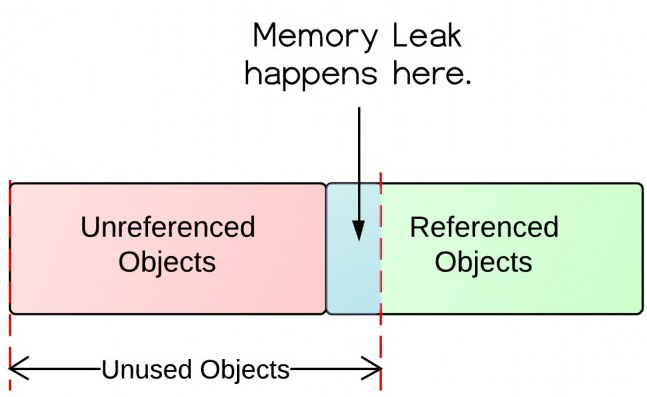

# Garbage Collection and Benchmarking

> This is a Java course to understand garbage collection, JVM tuning techniques and performance benchmarking.

Tools used:

- JDK 11
- Maven
- JUnit 5, Mockito
- IntelliJ IDE

## Table of contents

1. [Garbage Collection](https://github.com/backstreetbrogrammer/41_GarbageCollectionAndBenchmarking#chapter-01-garbage-collection)
    - [Introduction to Java Garbage Collector](https://github.com/backstreetbrogrammer/41_GarbageCollectionAndBenchmarking#introduction-to-java-garbage-collector)
    - [Generational Heaps](https://github.com/backstreetbrogrammer/41_GarbageCollectionAndBenchmarking#generational-heaps)
    - [Types of Garbage Collectors](https://github.com/backstreetbrogrammer/41_GarbageCollectionAndBenchmarking#types-of-garbage-collectors)
        - [Serial GC](https://github.com/backstreetbrogrammer/41_GarbageCollectionAndBenchmarking#serial-gc)
        - [Parallel/Throughput GC](https://github.com/backstreetbrogrammer/41_GarbageCollectionAndBenchmarking#parallelthroughput-gc)
        - [Concurrent Mark Sweep (CMS) GC](https://github.com/backstreetbrogrammer/41_GarbageCollectionAndBenchmarking#concurrent-mark-sweep-cms-gc)
        - [G1 (Garbage First)](https://github.com/backstreetbrogrammer/41_GarbageCollectionAndBenchmarking#g1-garbage-first)
        - [ZGC](https://github.com/backstreetbrogrammer/41_GarbageCollectionAndBenchmarking#zgc)
    - [Which Garbage Collector to use?](https://github.com/backstreetbrogrammer/41_GarbageCollectionAndBenchmarking#which-garbage-collector-to-use)
2. [Heap monitoring and analysis](https://github.com/backstreetbrogrammer/41_GarbageCollectionAndBenchmarking#chapter-02-heap-monitoring-and-analysis)
    - [Interview Problem 1 (Bullish - cryptocurrency exchange) - How to capture heap dumps for analysis?](https://github.com/backstreetbrogrammer/41_GarbageCollectionAndBenchmarking#interview-problem-1-bullish---cryptocurrency-exchange---how-to-capture-heap-dumps-for-analysis)
    - [Interview Problem 2 (Goldman Sachs) - What is memory leak in Java and how to identify and prevent it?](https://github.com/backstreetbrogrammer/41_GarbageCollectionAndBenchmarking#interview-problem-2-goldman-sachs---what-is-memory-leak-in-java-and-how-to-identify-and-prevent-it)
3. Thread dumps analysis
4. Summary of most important JVM parameters

---

## Chapter 01. Garbage Collection

### Introduction to Java Garbage Collector

In many other programming languages, programmers manage the creation and removal of objects to moderate memory usage.

In **Java**, programmers focus on application functionality while the **Garbage Collector (GC)** controls how memory is
used.

The GC automatically frees the memory space consumed by objects which are no longer used. When objects stored in memory
have become **unreachable** for the program, the GC detects them and cleans them up.

GC is at the center of **memory management** for Java applications which helps to avoid the accidental **memory leaks**
and **fragmentation** issues.

**_What is memory management in Java?_**

Memory management is an **automated** process that is executed by the Java Virtual Machine (JVM).

One responsibility of the JVM is overseeing the **heap**, which is the space where all the objects created by a Java
program are held. The heap is important because it stores information that the application can use to run more
efficiently.

The **Just-In-time (JIT)** Compiler, traditionally located in the Java Virtual Machine (JVM), is responsible for memory
disposal.

When memory is not relevant or useful to the program, the JIT is responsible for disposing of it. In the JIT, the
garbage collector locates unused objects to clear memory space.

When the garbage collector categorizes objects, objects are placed at different locations in the heap. There are
different storage locations in the heap, where objects are situated based on how long they've remained in the heap.

Objects can be moved into the tenured location after surviving many processes and can eventually become permanent in the
memory.

**_How Does a Java Garbage Collector Work?_**

The whole idea of a managed language – like Java – is that the complexity of such an essential and extensive
implementation as a GC is actually **hidden** for us.

Which means we don't need to care! Because a lot of developers are working hard on the runtime and the language itself,
the vast user base of developers can benefit from all the work that is happening **under the hoods.**

The initial GC in the original JVM was very limited and not working seamlessly, but after all the evolutions, the
current overhead of the GC is way less noticeable.

A GC process can follow different approaches and, in all cases, contains one or more of the following steps:

- **_Mark (= Trace)_**: starting from the application's root, all linked memory blocks that can be reached are
  **Painted**. Imagine this as a tree with branches, where all leaves are colored. When all endpoints of the branches
  are reached, the painted blocks can be considered as **Live,** while the remaining memory blocks that are not painted
  can be considered as **Non-Live.**
- **_Sweep_**: all the **Non-Live** objects are **cleared** from the heap memory.
- **_Compact_**: **Live** memory objects are brought closer together (`defragmentation`, `relocation`) to ensure big
  free memory blocks are available for new objects. Some collectors will have a **second pass** to update the references
  in the application to memory objects to make sure they are pointing to the correct locations in the memory.
- **_Copy_**: this is another method to improve how the memory is used. In this process, all the **Live** objects are
  moved to a **To** space, while the remaining objects in the **From** space can be considered as **Non-Live.**

There are multiple types of GCs depending on which of these approaches they use:

- Mark/Sweep/Compact
- Copy
- Mark/Compact

A few other terms related to how the GC is implemented are essential when we want to understand the GC process better:

- Single versus multiple passes:
    - **Single-pass**: multiple steps are handled in a single run.
    - **Multi-pass**: in a multi-pass, the steps are handled in different passes, one after the other.
- Serial versus Parallel:
    - **Serial**: one GC thread
    - **Parallel**: multiple GC threads
- Stop-The-World versus Concurrent:
    - **Stop-The-World**: the application is stopped while the GC cycle is running.
    - **Concurrent**: the GC is running **next to** the application and has no impact on the application execution.

**_Live Set and Allocation Rate_**

As described in the different stages, the **live set**, which contains all the objects still in use, is an essential
factor in the behavior of the GC.

If an application has a constant load and behavior, and objects are added and removed from the **live set** steadily,
its size will remain stable.

A growing **live set** can be caused by a **memory leak**.

The `-Xmx` flag defines an application's maximum heap size.

If the size of the **live set** approaches the `-Xmx` size, the JVM lacks free memory to store new objects and perform
the GC. This will decrease the performance.

To keep the size of our server well-dimensioned to run our application, we need to balance the amount of installed
memory and the `-Xmx` value with the actual size of the **live set**.

Over-dimensioning our server is just a waste of money. But to correctly define this dimension, the **allocation rate**
must be considered.

This **allocation rate** is a value based on the amount of memory allocated per time unit, for instance, `MB/sec`.

A high value can indicate that a lot of objects are being created, resulting in the fact that a lot of cleanups will be
needed. This will impact the frequency and/or duration of the GC pauses.

A good guideline for the heap size (`-Xmx`) is `2.5` to `5` times the size of the average **live set**. The higher the
**allocation rate**, the bigger the heap must be for optimal GC.

### Generational Heaps

Another technique used in GC is **generational heaps,** keeping **young** versus **old** objects in different areas of
the heap because:

- Most objects die young
- Few references from older to younger objects exist

Using this hypothesis, the Java heap is separated into two physical areas:

- **Young generation**: this is where new objects are allocated and where objects are stored which are not old enough
  to get promoted. This is typically a smaller set with a lot of garbage objects that is handled quickly by the GC.
  Typically, `Young Generation Stop-The-World` GCs are **single** passes. The young generation is further divided into
  sections known as **Eden** and the **Survivor spaces** to move young objects if they are used for a longer time.
- **Old generation**: objects that live longer are eventually promoted to the old generation. This set is handled less
  frequently by the GC but takes a longer time.

In many cases, the **Old generation** is larger than the **Young generation**, but not always. This depends on the
static working **live set** of the application and how elastic the boundary between the Young and Old generations is.

In region-based generational collectors (`C4` and `G1`), the size of the generations is **fluid** and **elastic**. Most
of the regions could be the **Young generation**, or most could be the **Old generation**.

In collectors like `CMS`, `Parallel`, and `Serial`, the boundary between the two generations was **fixed**, and the
ratio between new and old generation sizes may have to be tuned.


New objects get allocated into the **Eden** space until it fills up. During the GC, **live** objects (reachable objects)
in the **Eden** and **Survivor** space are copied to the other **Survivor** space.

If any objects become **old enough,** they are copied to the **Old generation** (i.e. they are **tenured**).

We can take advantage of the young generation system by focusing on local variables within methods that have a short
lifetime, so the GC can focus on a subset of the heap that can quickly be handled.

**String pool optimization**

**Java 8u20** has introduced one JVM parameter for reducing the unnecessary use of memory by creating too many instances
of the same String. This optimizes the heap memory by removing duplicate String values to a global single `char[]`
array.

We can enable this parameter by adding `-XX:+UseStringDeduplication` as a JVM parameter.

### Types of Garbage Collectors

Just like Java-the-language has evolved, the runtime and tools have evolved a lot, and different GCs have been part of
the JRE.

| Name                                              | isParallel | isConcurrent | isGenerational                  | JVM Option                                                                                                                                                | Java version                                     |
|---------------------------------------------------|------------|--------------|---------------------------------|-----------------------------------------------------------------------------------------------------------------------------------------------------------|--------------------------------------------------|
| Serial                                            | No         | No           | Yes                             | -XX:+UseSerialGC                                                                                                                                          |                                                  |
| Parallel / Throughput                             | Yes        | No           | Yes                             | -XX:+UseParallelGC                                                                                                                                        |                                                  |
| Concurrent Mark and Sweep (CMS)                   | Yes        | Partially    | Yes                             | -XX:+UseParNewGC <br/> or as of Java 9: <br/> -XX:+UseConcMarkSweepGC <br/> and if we want to define the number of threads <br/> -XX:ParallelCMSThreads=n | Deprecated since Java 9 and removed from Java 14 |
| G1 (Garbage First)                                | Yes        | Partially    | Yes                             | -XX:+UseG1GC                                                                                                                                              | JDK 7 (update 4)                                 |
| Shenandoah GC                                     | Yes        | Fully        | No (upto JDK 17, may be later?) | -XX:+UseShenandoahGC                                                                                                                                      | JDK 15                                           |
| ZGC                                               | Yes        | Fully        | No (upto JDK 17, may be later?) | -XX:+UseZGC                                                                                                                                               | JDK 15                                           |
| C4 - Continuously Concurrent Compacting Collector | Yes        | Fully        | Yes                             | None, this is the default in Azul Zulu Prime                                                                                                              | Only in Azul Zulu Prime                          |

#### Serial GC

The serial collector uses a **single thread** to perform all the garbage collection work and uses **stop-the-world**,
meaning it freezes all application threads when it runs.

It's selected by default on certain small hardware and operating system configurations, or it can be explicitly enabled
with the following argument:

```
java -XX:+UseSerialGC Application.java
```

**Pros**:

- Without inter-thread communication overhead, it's relatively efficient.
- It's suitable for client-class machines and embedded systems.
- It's suitable for applications with small datasets.
- Even on multiprocessor hardware, if data sets are small (up to `100 MB`), it can still be the most efficient.

**Cons**:

- It's not efficient for applications with large datasets.
- It can't take advantage of multiprocessor hardware.

#### Parallel/Throughput GC

It's the default GC of the JVM from **Java 5** until **Java 8**, or it can be explicitly enabled as:

```
java -XX:+UseParallelGC Application.java
```

Unlike Serial Garbage Collector, it uses **multiple threads** for managing heap space, but it also freezes other
application threads while performing GC.

If we use this GC, we can specify maximum garbage collection threads and pause time, throughput, and footprint (heap
size):

- The **number of garbage collector threads** can be controlled with the command-line option:
  `-XX:ParallelGCThreads=<N>`
- The **maximum pause time goal** (a hint to the garbage collector that pause time of `<N> milliseconds` or less is
  desired) is specified with the command-line option: `-XX:MaxGCPauseMillis=<N>`
- The time spent doing garbage collection versus the time spent outside garbage collection is called the **maximum
  throughput target** and can be specified by the command-line option: `-XX:GCTimeRatio=<N>`
- The **maximum heap footprint** (the amount of heap memory that a program requires while running) is specified using
  the option: `-Xmx<N>`

**Pros**:

- It can take advantage of multiprocessor hardware.
- It's more efficient for larger data sets than serial GC.
- It provides high overall **throughput**.
- It attempts to minimize the **memory footprint**.

**Cons**:

- Applications incur long pause times during stop-the-world operations.
- It doesn't scale well with heap size.

#### Concurrent Mark Sweep (CMS) GC

CMS is mostly concurrent collector, meaning, it performs some expensive work **concurrently** with the application.

It's designed for low latency by eliminating the long pause associated with the full GC of parallel and serial
collectors.

CMS can be explicitly enabled as:

```
java -XX:+UseConcMarkSweepGC Application.java
```

The core Java team deprecated it as of **Java 9** and completely removed it in **Java 14**.

**Pros**:

- It's great for low latency applications as it minimizes pause time.
- It scales relatively well with heap size.
- It can take advantage of multiprocessor machines.

**Cons**:

- It's deprecated as of Java 9 and removed in Java 14.
- It becomes relatively inefficient when data sets reach gigantic sizes or when collecting humongous heaps.
- It requires the application to share resources with GC during concurrent phases.
- There may be throughput issues as there's more time spent overall in GC operations.
- Overall, it uses more CPU time due to its mostly concurrent nature.

#### G1 (Garbage First)

G1 (Garbage First) Garbage Collector is designed for applications running on multi-processor machines with large memory
space. It's available from the **JDK7 Update 4** and in later releases.

Unlike other collectors, the G1 collector partitions the heap into a set of **equal-sized** heap regions, each a
contiguous range of virtual memory.

When performing garbage collections, G1 shows a concurrent global marking phase (i.e. phase 1, known as **Marking**) to
determine the liveliness of objects throughout the heap.

After the mark phase is complete, G1 knows which regions are mostly empty. It collects in these areas first, which
usually yields a significant amount of free space (i.e. phase 2, known as **Sweeping**).

G1 uses multiple background GC threads to scan and clear the heap just like **CMS**. Actually, the core Java team
designed G1 as an improvement over CMS, patching some of its weaknesses with additional strategies.

In addition to the incremental and concurrent collection, it tracks previous application behavior and GC pauses to
achieve **predictability**.

It then focuses on reclaiming space in the most efficient areas first — those mostly filled with garbage. We call it
**Garbage-First** for this reason.

Since Java 9, G1 is the default collector for server-class machines.

G1 works best for applications with very strict pause-time goals and a modest overall throughput, such as real-time
applications like trading platforms or interactive graphics programs.

To enable the G1 Garbage Collector, we can use the following argument:

```
java -XX:+UseG1GC Application.java
```

**Pros:**

- It's very efficient with gigantic datasets.
- It takes full advantage of multiprocessor machines.
- It's the most efficient in achieving pause time goals.

**Cons:**

- It's not the best when there are strict throughput goals.
- It requires the application to share resources with GC during concurrent collections.

#### ZGC

ZGC (Z Garbage Collector) is a scalable low-latency garbage collector that debuted in **Java 11** as an experimental
option for _Linux_. **JDK 14** introduced ZGC under the _Windows_ and _macOS_ operating systems. ZGC has obtained the
production status from **Java 15** onwards.

ZGC performs all expensive work concurrently, without stopping the execution of application threads for more than
`10 ms`, which makes it suitable for applications that require low latency.

It uses load barriers with colored pointers to perform concurrent operations when the threads are running, and they're
used to keep track of heap usage.

Reference coloring (colored pointers) is the core concept of ZGC. It means that ZGC uses some bits (metadata bits) of
reference to mark the state of the object.

It also handles heaps ranging from `8MB` to `16TB` in size. Furthermore, pause times don’t increase with the heap,
live-set, or root-set size.

Similar to **G1**, **Z Garbage Collector** partitions the heap, except that heap regions can have **different** sizes.

To enable the Z Garbage Collector, we can use the following argument in JDK versions **lower than 15**:

```
java -XX:+UnlockExperimentalVMOptions -XX:+UseZGC Application.java
```

**From version 15** on, we don’t need experimental mode on:

```
java -XX:+UseZGC Application.java
```

**_Use Case 1_**

GCs have evolved a lot in recent decades. As a Java developer, we need to be aware that some tips for older GC
generations are not applicable anymore.

**C4**, **ZGC**, and **Shenandoah** are truly **concurrent**.

The pause times with these modern GCs are tiny, often units of milliseconds or even lower.

The size of the live set (objects that cannot be collected because they have references that may still be used in the
future) still determines the duration of the GC cycles, but the application is not paused while they are running.

The pause times do not scale with an increase in live set or heap size.

Traditionally, there has been a conscious attempt to design applications in such a way as to avoid needing larger Java
heaps.

One thing that developers still need to be careful about is avoiding leaks in the Java heap that can lead to **high live
sets** for GC.

The duration of, and CPU consumption by, most modern GCs is proportional to the size of live set. The Java ecosystem has
several tools that can help analyze live sets and identify problems.

**_Use Case 2_**

The GC has a significant impact on how your application behaves. Still, as a developer, we should also be aware that
certain coding practices can have an impact on how Java uses memory, and some problems can also get fixed with a
code change!

One of the examples where we have seen such wins is in **statistics** and **parser applications**, where a lot of
data is copied and only used once.

Creating and using **short-lived small** objects or `ArrayLists` is not a problem.

But when **large** data structures are used in a **"create to discard"** mode,the memory allocation rate can get out of
hand, and re-use of data structures can be beneficial.

An example would be single-use large buffers or arrays containing millions of objects of the same size.

A generational GC that is optimized to make the difference between young and old objects works best when there are two
**stereotypes** of data:

- Transactional data: objects that are created during a transaction or event and die within seconds or milliseconds.
- Reference data: data loaded once and referenced (read) but not modified by a transaction.

On the other hand, the **"worst"** kind of memory for a GC is a **rolling buffer (FIFO)**, where data lives for minutes
or hours. This is not a programming issue but has a **"business"** reason – for example, when a rolling transaction log,
session buffer, or similar must be used.

When an application is constantly modifying its **"old"** long-lived data at a high rate, then non-concurrent GCs sooner
or later run into trouble and need a full GC.

**_Use Case 3_**

For specific projects, it is clear that the heap size is causing long pauses in the application execution caused by the
Garbage Collector.

For example, projects where a `100GB` heap is used can expect pause times of over `10 seconds` when the GC is cleaning
up the memory.

In other cases, for example, financial and gaming applications, a smaller heap of `10GB` size which stops for hundreds
of **milliseconds** can already be a big problem.

Anyhow, having a Garbage Collector that doesn't stop our application completely for an unpredictable time is essential
for every project that expects consistent short response times; low latency in other words.

**Clusters** are another example where we have seen problems caused by the GC.

When one node with a big heap is considered dead because it is not responding during a GC cycle, a process is started to
spin up a new node and redistribute the data. But suddenly, the node that is considered to be dead re-appears after the
GC cycle, causing a chain of undesired events in the cluster.

### Which Garbage Collector to use?

For many applications, the choice of the collector is never an issue, as the **JVM default** usually suffices.

That means the application can perform well in the presence of garbage collection with pauses of acceptable frequency
and duration.

However, this isn't the case for a large class of applications, especially those with humongous datasets, many threads,
and high transaction rates.

In IT project management, there is a famous rule: "You need to choose between speed, quality, and cost. But you can only
have 2 out of these 3."

There seems to be a consensus that the same applies in regard to running an application. We need to pick two of the
following:

- Very low latency
- Very high throughput
- Lowest resource usage (CPU and memory)

But there is actually a fourth element we should add here: **"Good Engineering!"**

**_Variables to Consider_**

**Heap Size**

This is the total amount of working memory allocated by the OS to the JVM. Theoretically, the larger the memory, the
more objects can be kept before collection, leading to longer GC times.

The minimum and maximum heap sizes can be set using `-Xms=<n>` and `-Xmx=<m>` command-line options.

**Application Data Set Size**

This is the total size of objects an application needs to keep in memory to work effectively. Since all new objects are
loaded in the young generation space, this will definitely affect the maximum heap size and, hence, the GC time.

**Number of CPUs**

This is the number of cores the machine has available. This variable directly affects which algorithm we choose. Some
are only efficient when there are multiple cores available, and the reverse is true for other algorithms.

**Pause Time**

The pause time is the duration during which the garbage collector stops the application to reclaim memory. This variable
directly affects latency, so the goal is to limit the longest of these pauses.

**Throughput**

By this, we mean the time processes spend actually doing application work. The higher the application time vs. overhead
time spent in doing GC work, the higher the throughput of the application.

**Memory Footprint**

This is the working memory used by a GC process. When a setup has limited memory or many processes, this variable may
dictate scalability.

**Promptness**

This is the time between when an object becomes dead and when the memory it occupies is reclaimed. It's related to the
heap size. In theory, the larger the heap size, the lower the promptness as it will take longer to trigger collection.

**Latency**

This is the responsiveness of an application. GC pauses affect this variable directly.

**Java Version**

As new Java versions emerge, there are usually changes in the supported GC algorithms and also the default collector. We
recommend starting off with the default collector as well as its default arguments. Tweaking each argument has varying
effects depending on the chosen collector.

**Concurrent Garbage Collectors**

When the GC is concurrent, it shares the resources with application threads running concurrently.

Thus, the duration of the GC cycle can be impacted by the level of CPU load on the system or inside a container.

A **Stop-The-World** GC does not face this issue since it stops all the Java threads when it runs.

Thus, if the system is highly saturated, a concurrent GC can take significant time and introduce allocation pauses.

To reap full benefit from concurrent GC, it is advisable to keep the CPU load average below the number of cores
available.

Of course, the eventual GC behavior will depend on a combination of factors – live set, allocation rate, and CPU load
average.

---

## Chapter 02. Heap monitoring and analysis

One of the core benefits of Java is the automated memory management with the help of the built-in Garbage Collector (or
GC for short). The GC implicitly takes care of allocating and freeing up memory, and thus is capable of handling the
majority of memory leak issues.

While the GC effectively handles a good portion of memory, it doesn't guarantee a foolproof solution to memory leaking.
The GC is pretty smart, but not flawless. Memory leaks can still sneak up, even in the applications of a conscientious
developer.

### Interview Problem 1 (Bullish - cryptocurrency exchange) - How to capture heap dumps for analysis?

A heap dump is a snapshot of all the objects that are in memory in the JVM at a certain moment. They are very useful to
troubleshoot memory-leak problems and optimize memory usage in Java applications.

Heap dumps are usually stored in binary format `hprof` files. We can open and analyze these files using tools like
`jhat` or `JVisualVM`.

For Eclipse users: [MAT](https://www.vogella.com/tutorials/EclipseMemoryAnalyzer/article.html).

**_JDK Tools_**

The JDK comes with several tools to capture heap dumps in different ways. All these tools are located under the `bin`
folder inside the `JAVA_HOME` directory. Therefore, we can start them from the command line as long as this directory is
included in the system path.

**_jmap_**

`jmap` is a tool to print statistics about memory in a running JVM. We can use it for local or remote processes.

```
jmap -dump:[live],format=b,file=<file-path> <pid>

// example
jmap -dump:live,format=b,file=/tmp/dump.hprof 13647
```

Arguments used:

- **live**: if set, it only prints objects which have active references and discards the ones that are ready to be
  garbage collected. This parameter is optional.
- **format=b**: specifies that the dump file will be in binary format. By default, its binary only.
- **file**: the file where the dump will be written to
- **pid**: id of the Java process

We can get the `pid` of a Java process by using the `jps` command.

**_jcmd_**

`jcmd` tool works by sending command requests to the JVM. We have to use it in the same machine where the Java process
is running.

One of its many commands is the `GC.heap_dump`. We can use it to get a heap dump just by specifying the `pid` of the
process and the output file path:

```
jcmd <pid> GC.heap_dump <file-path>

// example
jcmd 13647 GC.heap_dump /tmp/dump.hprof
```

As with `jmap`, the dump generated is in **binary** format.

**_JVisualVM_**

`JVisualVM` is a tool with a graphical user interface that lets us monitor, troubleshoot, and profile Java applications.

It can be dowloaded as open source from: [VisualVM](https://visualvm.github.io/)

One of its many options allows us to capture a **heap dump**. If we right-click on a Java process and select the
**"Heap Dump"** option, the tool will create a heap dump and open it in a new tab:


**_Capture a Heap Dump using JVM options_**

Above JDK tools methods help to capture heap dumps **manually** at a specific time. In some cases, we want to get a heap
dump when a `java.lang.OutOfMemoryError` occurs to help us investigate the error.

For these cases, Java provides the `HeapDumpOnOutOfMemoryError` and `HeapDumpPath` command-line option, which
generates a heap dump when a `java.lang.OutOfMemoryError` is thrown:

```
java -XX:+HeapDumpOnOutOfMemoryError -XX:HeapDumpPath=<file-or-dir-path> Application.java
```

There’s no overhead when running an application with this option. Therefore, it’s highly recommended to always use
this option, especially in production.

### Interview Problem 2 (Goldman Sachs) - What is memory leak in Java and how to identify and prevent it?

A Memory Leak is a situation where there are objects present in the heap that are no longer used, but the garbage
collector is unable to remove them from memory, and therefore, they're unnecessarily maintained.

A memory leak is bad because it blocks memory resources and degrades system performance over time. If not dealt with,
the application will eventually exhaust its resources, finally terminating with a fatal `java.lang.OutOfMemoryError`.

There are two different types of objects that reside in Heap memory, **referenced** and **unreferenced**.

Referenced objects are those that still have active references within the application, whereas unreferenced objects
don't have any active references.

The garbage collector removes unreferenced objects periodically, but it never collects the objects that are still being
referenced. This is where memory leaks can occur:



**_Memory Leak through `static` fields_**

In Java, `static` fields have a life that usually matches the entire lifetime of the running application (unless
`ClassLoader` becomes eligible for garbage collection).

Suppose we have a class like this:

```java
import java.util.ArrayList;
import java.util.List;
import java.util.concurrent.ThreadLocalRandom;

public class StaticMemoryLeakDemo {

    public static List<Double> list = new ArrayList<>();

    public void populateList() {
        for (int i = 0; i < 10000000; i++) {
            list.add(ThreadLocalRandom.current().nextDouble());
        }
        System.out.println("Debug Point 2");
    }

    public static void main(final String[] args) {
        System.out.println("Debug Point 1");
        new StaticMemoryLeakDemo().populateList();
        System.out.println("Debug Point 3");
    }
}
```

If we analyze the heap memory during this program execution, then we’ll see that between **Debug points 1 and 2**, the
heap memory increased as expected.

But when we leave the `populateList()` method at the **debug point 3**, the heap memory isn't yet garbage collected.

However, if we just drop the keyword `static` and make `List` as non-static, then it'll bring a drastic change to the
memory usage as all the memory of the list is garbage collected because we don't have any reference to it.

Thus, ff collections or large objects are declared as `static`, then they remain in the memory throughout the lifetime
of the application, thus blocking vital memory that could otherwise be used elsewhere.

To prevent it:

- Minimize the use of `static` variables.
- When using `singletons`, rely upon an implementation that lazily loads the object, instead of eagerly loading.

**_Memory Leak through unclosed resources_** 

